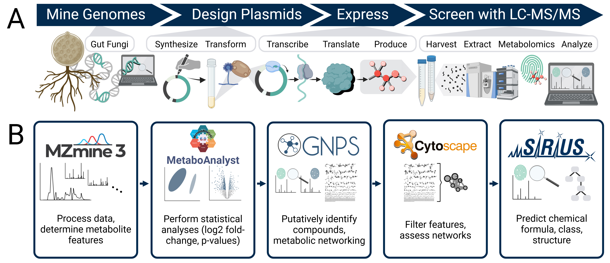

# Heterologous Expression of Anaerobic Gut Fungal Polyketides and Nonribosomal Peptides in Model Fungal Hosts

## Background
*In silico* genome mining tools predict many biosynthetic gene clusters for secondary metabolites from anaerobic gut fungi (phylum Neocallimastigomycota) (Swift et al. 2021). In this research project, we sought to learn more about the products of these gene clusters via the technique of heterologous expression, wherein we performed the following:
1. We inserted predicted biosynthetic genes into vectors
2. We transformed the vectors into model host microbes - in this project, *Saccharomyces cerevisiae* and *Aspergillus nidulans*
3. We cultured the transformed host microbes under expression conditions
4. We harvested culture samples (cell pellets) for data analysis and screening.

For this project, we implemented an **untargeted metabolomics screen with LC-MS/MS** (liquid chromatography with tandem mass spectrometry) to determine which expression groups possessed standout metabolites (by abundance and t-test statistics) relative to the negative control: the model host microbe expressing the corresponding empty vector (the transformed vector with no inserted gene to express). 

We used two approaches to analyze the untargeted LC-MS/MS datasets: (1) **Feature-based molecular networking (FBMN)** (Scripts 1 - 4) (see Figure 1 below) (Nothias et al. 2020) and (2) **Classical Molecular Networking (CMN)** (Script 5) (Wang et al. 2017). Please refer to documentation on the GNPS ([Global Natural Product Social Molecular Networking](https://gnps.ucsd.edu/)) web platform for a description of the FBMN vs. CMN approaches. Broadly, FBMN and CMN use different methods to distinguish metabolite signals in the data, with FBMN determining distinct peaks (features) for metabolites and CMN only considering MS/MS spectra. For this project and set of scripts, the CMN approach is more lenient for determining if a metabolite signal is real. For the FBMN approach, we utilized multiple existing tools to perform data processing and analysis: MZmine3 (Schmid et al. 2023), MetaboAnalyst (Xia et al. 2011), GNPS (Wang et al. 2017; Nothias et al. 2020), and the SIRIUS suite of tools (Dührkop et al. 2019), which includes ZODIAC (Ludwig et al. 2020), CSI:FingerID (Dührkop et al. 2015), and CANOPUS (Djoumbou Feunang et al. 2016; Dührkop et al. 2021; Kim et al. 2021; Hoffmann et al. 2022). For the CMN approach, we utilized GNPS and SIRIUS.

**Figure 1.** Heterologous expression was implemented to study anaerobic gut fungal secondary metabolite potential. (A) Predicted NRPS and PKS core biosynthetic genes were mined from anaerobic gut fungi, inserted into expression plasmids, transformed into S. cerevisiae and A. nidulans, expressed, and screened for expected expression products (RNA/protein/metabolites). (B) The LC-MS/MS data analysis workflow with feature-based molecular networking (FBMN) systematically processed the data and compared expression groups against their corresponding empty vector control. Follow-up data analysis was performed with a classical molecular networking workflow with relatively more lenient filtering cutoffs. Figure was created with [BioRender.com](https://www.biorender.com/).

While screening heterologous expression is a main use case for this workflow, other untargeted LC-MS/MS data sources with 2 sample groups (Experimental vs. Control) can be similarly processed and analyzed. Overall, datasets run through this workflow include the following experimental-control pairings:

| Experimental (EXP) Group                                    | Control (CTRL) Group for Comparison                               |
| ------------------------------------------------- | ----------------------------------------- |
| Heterologous Expression | Empty Vector Negative Control |
| Cultured Anaerobic Gut Fungi | Media Negative Control |
| Cultured Anaerobic Gut Fungi Spiked with Epigenetic Elicitors | Cultured Anaerobic Gut Fungi Spiked with Blank Solvent |

## Associated Publication
[to be filled in after publication]

## Data Availability
Raw .mzML data files will be made publicly available on the MASSIVE data repository once the corresponding publication is published. (to-do: update after publication)

## Script Summaries: Feature-based Molecular Networking
### Script_1_MZmine3_multi-job_workflow.py
Script 1 is a Python script that automates MZmine3 preprocessing of LC-MS/MS data. It creates metadata files, modifies XML parameters (based on your manually curated parameters template file), executes MZmine3 via command line, and prepares inputs to MetaboAnalyst, GNPS, and SIRIUS analysis. The script also handles FTP upload of processed data to GNPS servers.

### Script_2_MetaboAnalyst_multi-job_workflow.r 
Script 2 is an R script that performs statistical analysis of metabolomics data using MetaboAnalystR. Features include data normalization, fold-change analysis, t-tests, and principal component analysis (PCA). The script generates visualizations and statistical outputs for metabolite abundance comparisons.

### Script_3_Cytoscape_networking_multi-job_workflow.py
Script 3 is a Python script that formats and filters molecular networks in Cytoscape (Shannon et al. 2003). It processes GNPS networking results, incorporates MetaboAnalyst statistical data, and applies custom visual styles. The script includes filtering options to highlight metabolites of interest and generates detailed node attribute tables.

### Script_4_Volcano_Plots.py
Script 4 is a Python script that generates stylized volcano plots using MetaboAnalyst data (from Script 2). 

## Script Summary: Classical Molecular Networking
### Script_5_Groupings_GNPS_Analysis.py
Script 5 is a Python script that formats and filters classical molecular networks from GNPS. This script enables comparison of multiple experimental (EXP) vs. control (CTRL) pairs to define metabolite features of interest for further investigation (ie: SIRIUS chemical predictions).

## Script Details: Feature-based Molecular Networking (FBMN) Workflow
### FBMN Part 1:
#### Before running Script 1:

- Organize data files:
    - (1) Manual: convert data files to .mzML format
    - (2) Manual (optional): if necessary, consider writing custom code to rename filenames from long original names to shorter, descriptive names
    - (3) Manual: create "data" folder and populate with .mzML data files
        - Example: "C:\Users\lazab\Desktop\python_scripts\workspace\LCMSMS_analysis_pipeline\data\{data files folder}\{data files}"
        - Note: create a separate {data files folder} sub-folder for EXP with base job name and CTRL samples
        - Note: to run the workflow with the data from the heterologous expression of gut fungal secondary metabolites, see the MASSIVE data repository once the data is public (to-do: update once published)

- Setup GNPS and WinSCP accounts to run jobs on GNPS
    - (4) Manual (one-time): create GNPS account and WinSCP connect to massive.ucsd.edu FTP (see GNPS documentation, use same username and password as GNPS account). Consider creating a .env file in the working directory to hold the email, username, and password information (see Script 1 code for context)

- Setup metadata excel sheet with job information
    - (5) Manual: fill out a main metadata excel sheet with running account of job information for all jobs, as well as info for all changeable values (see format of "Overall_Running_Metadata_for_All_LCMSMS_Jobs.xlsx" in the input folder)
    - Excel Columns: Job Name, Control Folder, Ionization, RT minimum cutoff, ABMBA_Feature_Name_from_Script_1, MZmine3 batch template
    - Note: determine the RT minimum cutoff by viewing the chromatograms in MZmine and qualitatively approximate the metabolites that quickly come off the column. Remove these poorly separated metabolites to improve downstream data handling and statistical analysis.

- Determine MZmine3 parameters
    - (6) Manual: determine parameters for MZmine3 tool to run jobs and prepare a .xml parameters file template. If necessary, manually create an MZmine3 job for the data files to determine pre-processing parameters. Alternatively, use previously determined parameters.

#### &rarr; Run Script 1

#### Script 1 features:
- Creates GNPS and MetaboAnalyst Metadata .tsv files
- Edits the template .xml parameters file for MZmine3, using information in the overall metadata excel
- Runs MZmine3 in commandline using the edited .xml parameters file
- Organizes MZmine3 output files for GNPS input
- Uploads GNPS_input_for_job_name folder to GNPS via FTP
- Uses the MZmine3 output for GNPS input to generate the MetaboAnalyst input

### FBMN Part 2:

Suggested: use RStudio to run Script 2.

#### &rarr; Run Script 2

#### Script 2 features:
- Runs the MetaboAnalyst tool to generate statistics, including log2 fold-change and raw p-values. See the [MetaboAnalyst GitHub repository](https://github.com/xia-lab/MetaboAnalystR) and [tutorial](https://www.metaboanalyst.ca/resources/vignettes/Introductions.html) for more information.
- Creates empty GNPS_output job sub-folders for you to later manually populate with GNPS output files (see next Part).

#### After running Script 2:
- (1) Manual: check correctness of statistical treatments. For example, ensure appropriate feature and sample normalization (Gaussian curve) by going to temp folder --> job folder --> MetaboAnalystR Output --> normalization .png outputs.

### FBMN Part 3:
#### Before running Script 3:
- (1) Manual: run the [FBMN GNPS job](https://ccms-ucsd.github.io/GNPSDocumentation/featurebasedmolecularnetworking/). Once the job is complete, use the "Download Cytoscape Data" link to download GNPS outputs (zipped). Organize these outputs in job_name sub-folders (created in Script 2) in a folder "GNPS_output". Manually unzip folders contents for GNPS outputs. These files will include the .graphml molecular networking file.
- (2) Manual (one-time): determine style .xml settings for Cytoscape networks
- (3) Manual: have the Cytoscape program open in order to run Script 3

####  &rarr; Run Script 3

#### Script 3 features:
- Adjusts GNPS-generated molecular networks in Cytoscape using Python (py4cytoscape)
- Imports node table with additional data, create pie charts, adjust style, label compound names
- Aligns data analysis results from MZmine3, MetaboAnalyst, and GNPS
- Filters metabolite features in the Cytoscape network based on possible metabolites of interest (ie: highly detected in EXP samples and not in CTRL samples)
- If desired, searches data for specific compounds based on m/z and RT (with set +/- cutoffs), such as the standard ABMBA and the possible anaerobic gut fungal metabolite baumin (Swift et al. 2021).
- Generates filtered Cytoscape networks and formatted excels of features.
    - Output Excel Tabs: 
        - "All Peaks Simple": unfiltered list of all peaks, with column selection simplified
        - "All Peaks": unfiltered list of all peaks
        - "Filtered Peaks of Interest": filtered peaks, using MetaboAnalyst statistics
        - "Upreg Likely Host Metabolites": filtered peaks for metabolites likely present in the control samples but detected more in the experimental samples
        - "All Cmpd Matches": all detected metabolites with MS/MS match to GNPS reference databases
        - "Cmpd Matches No Sus": all detected metabolites with MS/MS match to GNPS reference databases, with "Suspect related to..." compound annotations removed.
        - "ABMBA Standard": specifies which feature likely corresponds with the ABMBA standard added to samples
        - "Putative Baumin": specifies which feature likely corresponds to the possible anaerobic gut fungal metabolite baumin (Swift et al. 2021).
        - "Filter Parameters": a record of the specific filtering parameters used in Script 3 to generate the output excel

### FBMN Part 4:

####  &rarr; Run Script 4

#### Script 4 features:
- Generates formatted volcano plots to visualize metabolite features that are more detected in EXP or CTRL. Features that are more significantly detected in EXP are potential expression products for heterologous expression studies, and ideally these features are not detected in any CTRL samples (assuming the host cannot naturally produce the metabolite).

### FBMN Part 5:
- Consider running the [SIRIUS](https://bio.informatik.uni-jena.de/software/sirius/) suite of tools using the MZmine3 .mgf file output for SIRIUS (file located in in temp folder, job sub-folder).
- SIRIUS predicts chemical formula, class, and structure from the MS/MS data.
- The MZmine3 feature IDs are consistent with feature IDs in the input for SIRIUS. In this way, you can generate and align SIRIUS predictions to filtered features of interest from Script 3.

## Script Details: Classical Molecular Networking (CMN) Workflow

### CMN Part 1:
#### Before running GNPS CMN Job:
- Note, these steps are the same as FBMN part 1 (organize data files before running Script 1)
- Organize data files
    - (1) Manual: convert data files to .mzML format
    - (2) Manual (optional): if necessary, consider writing custom code to rename filenames from long original names to shorter, descriptive names
    - (3) Manual: create "data" folder and populate with .mzML data files
        - Example: 
        - "C:\Users\lazab\Desktop\python_scripts\workspace\LCMSMS_analysis_pipeline\data\{data files folder}\{data files}"
        - Note: create a separate {data files folder} sub-folder for EXP with base job name and CTRL samples
        - Note: to run the workflow with the data from the heterologous expression of gut fungal secondary metabolites, see the MASSIVE data repository once the data is public (to-do: update once published)
    - (4) Either (i) run Script 1 for each EXP vs. CTRL in the grouping or (ii) generate job sub-folders in the temp folder and create a metadata file {job_name + "_metadata.tsv} (columns "Filename" and "Class"). This setup is required for running Script 5, because it informs the script which CTRL set of .mzML files correspond to which EXP set of .mzML files.
        - Example metadata .tsv file: "temp" folder in directory -> sub-folder of G1 name, where G1 is an experimental group (ie: "Yeast_HE_p9_pos_20240910") -> job_name + "_metadata.tsv":

| Filename                                   | Class                            |
| ------------------------------------------------- | ----------------------------------------- |
| 2024_POS_Y-EV_1_CTRL_Run88.mzML | CTRL |
| 2024_POS_Y-EV_2_CTRL_Run117.mzML | CTRL |
| 2024_POS_Y-EV_3_CTRL_Run138.mzML | CTRL |
| 2024_POS_Y-p9_1_Run100.mzML | EXP |
| 2024_POS_Y-p9_2_Run120.mzML | EXP |
| 2024_POS_Y-p9_3_Run155.mzML | EXP |

### CMN Part 2:
#### Run GNPS CMN Job
- (1) Manual: run the [GNPS CMN job](https://ccms-ucsd.github.io/GNPSDocumentation/networking/) ("METABOLOMICS-SNETS-V2" workflow). Follow the GNPS documentation to upload the .mzML files and perform CMN.
- (2) Manual (one-time): first, ensure there is a "GNPS_output" folder in the directory. Then, create a "Groupings_Analysis_Folders" folder within the "GNPS_output" folder.
- (3) Manual: For each job, create a job sub-folder in the "Groupings_Analysis_Folders" folder (naming convention: "Grouping_" + job_name + "_POS" OR "Grouping_" + job_name + "_NEG"). 
- (4) Manual: Once the GNPS CMN job is complete, populate the corresponding job folders (in the "Groupings_Analysis_Folders" folder) with output files. There are two job links to use: (i) "Download Bucket Table" to get raw spectral count data values (.tsv file) and (ii) "Download Clustered Spectra as MGF" to acquire the .mgf file that can be import to SIRIUS for compound predictions. From the downloaded outputs, there will also be a folder with the .graphml molecular networking file.

### CMN Part 3:
#### Before running Script 5:

- Setup metadata excel sheet with job information
    - (5) Manual: fill out a main metadata excel sheet with running account of job information for all jobs, as well as info for all changeable values (see format of "Script_5_Groupings_Metadata.xlsx" in the input folder, note this is a different metadata excel from the FBMN workflow).
    Excel Columns: Job Name, G1, G2, G3, G4, G5, G6, G1_temp_folder, G2_temp_folder, G3_temp_folder, G4_temp_folder, G5_temp_folder, G6_temp_folder, Ionization, Cytoscape_Format_Template_File
        - G# = Group # (can be EXP or CTRL)
        - G#_temp_folder = indicate the name of the job sub-folder in the temp folder. 
    - Note: I created different Cytoscape style files to format networks differently depending on the EXP vs. CTRL comparisons of interest. This information is relevant for how the script formats filtered molecular networks and visualize pie charts for relative spectral counts.

For example:

"styles_7_groupings_emphasis.xml": 

G1 = EXP1

G2 = CTRL1

G3 = EXP2

G4 = CTRL2

G5 = EXP3

G6 = CTRL 3

"styles_7_groupings_v2.xml":

G1 = EXP1

G2 = EXP2

G3 = EXP3

G4 = CTRL (same control fro EXP1-3)

ie: to compare 3 gut fungal strain samples against 1 media sample

"styles_7_groupings_v3.xml":

G1 = EXP1

G2 = EXP2

G3 = EXP3

G4 = CTRL for G1 and G2

G5 = CTRL for G3

ie: G1 and G2 have the same control, but G3 has a different control.

####  &rarr; Run Script 5
#### Script 5 features:
- Takes GNPS CMN outputs to format and filter molecular networks in Cytoscape, based on EXP and CTRL groups of interest to compare (termed "groupings").
- Create node pie charts to visualize relative spectral abundances (sum precursor abundances from bucket tables) for EXP and CTRL groups to compare.
- Filters metabolite features based on detection in EXP(s) and lack of detection in CTRL(s). The default cutoff is > 10^6^ average sum precursor abundance in EXP and < 10^6^ average sum precursor abundance in the corresponding CTRL.
- To generate filtered molecular networks, the script combinatorially compares EXP vs CTRL filter criteria. For example, for 3 EXP vs. CTRL pairings, the script will generate 7 networks based on features that pass the 3 criteria (EXP1-EXP2-EXP3, EXP1-EXP2, EXP1-EXP3, EXP2-EXP3, EXP1, EXP2, EXP3).

### CMN Part 4:
- Consider running the [SIRIUS](https://bio.informatik.uni-jena.de/software/sirius/) suite of tools using the GNPS output .mgf file, in order to further inspect filtered metabolites of interest.

## Installation: Dependencies
### Script 1: MZmine3 Multi-job Workflow
- Python 3.8+
- Required Python modules/packages:
    - pandas
    - xml.etree.ElementTree
    - subprocess
    - shutil
    - ftplib
    - python-dotenv
- [MZmine3](https://github.com/mzmine/mzmine3) installation 
- [GNPS](https://gnps.ucsd.edu/ProteoSAFe/static/gnps-splash.jsp) account with FTP access

### Script 2: MetaboAnalyst Multi-job Workflow  
- R 4.0+
- Required R modules/packages:
    - MetaboAnalystR
    - impute
    - pcaMethods
    - globaltest 
    - GlobalAncova
    - Rgraphviz
    - preprocessCore
    - genefilter
    - sva
    - limma
    - KEGGgraph
    - siggenes
    - BiocParallel
    - MSnbase
    - multtest
    - RBGL
    - edgeR
    - fgsea
    - devtools
    - crmn
    - httr
    - qs
    - readxl (for reading Excel metadata)
    - ggrepel (for plot labeling)
    - ellipse (for PCA plots)
    - vegan (for statistical analysis)

### Script 3: Cytoscape Networking Multi-job Workflow
- Python 3.8+
- Required Python modules/packages:
    - pandas
    - py4cytoscape
    - numpy
- [Cytoscape](https://cytoscape.org/) 3.9+ installation
- Running Cytoscape instance required during script execution

### Script 4
- Python 3.8+
- Required Python modules/packages:
    - pandas
    - numpy
    - matplotlib
    - adjustText

### Script 5
- Python 3.8+
- Required Python modules/packages:
    - pandas
    - numpy
    - matplotlib
    - py4cytoscape
- Cytoscape 3.9+ installation
- Running Cytoscape instance required during script execution

## Tutorial
For initial testing and troubleshooting of the scripts and installed dependencies:
- Consider using the "data_tutorial" folder and "Tutorial" tabs in the metadata Excel files
- Tutorial sample comparisons:
    - For FBMN, *S. cerevisiae* with p9 plasmid vs. empty vector control
    - For FBMN, *A. nidulans* with TJGIp11 plasmid vs. empty vector control
    - For CMN (Script 5), comparison of yeast with p9 vs yeast empty vector vs. *A. nidulans* with TJGIp11 vs *A. nidulans* empty vector. p9 and TJGIp11 are vectors containing a predicted non-ribosomal peptide synthetase gene from the anaerobic gut fungal strain *Anaeromyces robustus* S4.
Note: The metadata Excel files support multi-job analysis, with each row representing a separate experimental-control pairing to process.

## Support
For support with using these scripts, please contact butkovichlaza@gmail.com.

## Authors and Acknowledgements
Primary author: Lazarina Butkovich (University of California, Santa Barbara)

Thank you to Fred Krauss for feedback and assistance in writing and formatting these scripts. 

## References
Djoumbou Feunang, Y.; Eisner, R.; Knox, C.; Chepelev, L.; Hastings, J.; Owen, G.; Fahy, E.; Steinbeck, C.; Subramanian, S.; Bolton, E.; Greiner, R.; Wishart, D. S. ClassyFire: Automated Chemical Classification with a Comprehensive, Computable Taxonomy. J Cheminform 2016, 8 (1), 1–20. https://doi.org/10.1186/s13321-016-0174-y.

Dührkop, K.; Shen, H.; Meusel, M.; Rousu, J.; Böcker, S. Searching Molecular Structure Databases with Tandem Mass Spectra Using CSI:FingerID. Proc Natl Acad Sci U S A 2015, 112 (41), 12580–12585. https://doi.org/10.1073/pnas.1509788112.

Dührkop, K.; Fleischauer, M.; Ludwig, M.; Aksenov, A. A.; Melnik, A. V.; Meusel, M.; Dorrestein, P. C.; Rousu, J.; Böcker, S. SIRIUS 4: A Rapid Tool for Turning Tandem Mass Spectra into Metabolite Structure Information. Nat Methods 2019, 16 (4), 299–302. https://doi.org/10.1038/s41592-019-0344-8.

Dührkop, K.; Nothias, L. F.; Fleischauer, M.; Reher, R.; Ludwig, M.; Hoffmann, M. A.; Petras, D.; Gerwick, W. H.; Rousu, J.; Dorrestein, P. C.; Böcker, S. Systematic Classification of Unknown Metabolites Using High-Resolution Fragmentation Mass Spectra. Nat Biotechnol 2021, 39 (4), 462–471. https://doi.org/10.1038/s41587-020-0740-8.

Hoffmann, M. A.; Nothias, L. F.; Ludwig, M.; Fleischauer, M.; Gentry, E. C.; Witting, M.; Dorrestein, P. C.; Dührkop, K.; Böcker, S. High-Confidence Structural Annotation of Metabolites Absent from Spectral Libraries. Nat Biotechnol 2022, 40 (3), 411–421. https://doi.org/10.1038/s41587-021-01045-9.

Kim, H. W.; Wang, M.; Leber, C. A.; Nothias, L. F.; Reher, R.; Kang, K. Bin; Van Der Hooft, J. J. J.; Dorrestein, P. C.; Gerwick, W. H.; Cottrell, G. W. NPClassifier: A Deep Neural Network-Based Structural Classification Tool for Natural Products. Journal of Natural Products. American Chemical Society November 26, 2021, pp 2795–2807. https://doi.org/10.1021/acs.jnatprod.1c00399.

Ludwig, M.; Nothias, L. F.; Dührkop, K.; Koester, I.; Fleischauer, M.; Hoffmann, M. A.; Petras, D.; Vargas, F.; Morsy, M.; Aluwihare, L.; Dorrestein, P. C.; Böcker, S. Database-Independent Molecular Formula Annotation Using Gibbs Sampling through ZODIAC. Nat Mach Intell 2020, 2 (10), 629–641. https://doi.org/10.1038/s42256-020-00234-6.

Nothias, L.-F.; Petras, D.; Schmid, R.; Dührkop, K.; Rainer, J.; Sarvepalli, A.; Protsyuk, I.; Ernst, M.; Tsugawa, H.; Fleischauer, M.; Aicheler, F.; Aksenov, A. A.; Alka, O.; Allard, P.-M.; Barsch, A.; Cachet, X.; Caraballo-Rodriguez, A. M.; Da Silva, R. R.; Dang, T.; Garg, N.; Gauglitz, J. M.; Gurevich, A.; Isaac, G.; Jarmusch, A. K.; Kameník, Z.; Kang, K. Bin; Kessler, N.; Koester, I.; Korf, A.; Le Gouellec, A.; Ludwig, M.; Martin H., C.; McCall, L.-I.; McSayles, J.; Meyer, S. W.; Mohimani, H.; Morsy, M.; Moyne, O.; Neumann, S.; Neuweger, H.; Nguyen, N. H.; Nothias-Esposito, M.; Paolini, J.; Phelan, V. V.; Pluskal, T.; Quinn, R. A.; Rogers, S.; Shrestha, B.; Tripathi, A.; van der Hooft, J. J. J.; Vargas, F.; Weldon, K. C.; Witting, M.; Yang, H.; Zhang, Z.; Zubeil, F.; Kohlbacher, O.; Böcker, S.; Alexandrov, T.; Bandeira, N.; Wang, M.; Dorrestein, P. C. Feature-Based Molecular Networking in the GNPS Analysis Environment. Nat Methods 2020, 17 (9), 905–908. https://doi.org/10.1038/s41592-020-0933-6.

Schmid, R.; Heuckeroth, S.; Korf, A.; Smirnov, A.; Myers, O.; Dyrlund, T. S.; Bushuiev, R.; Murray, K. J.; Hoffmann, N.; Lu, M.; Sarvepalli, A.; Zhang, Z.; Fleischauer, M.; Dührkop, K.; Wesner, M.; Hoogstra, S. J.; Rudt, E.; Mokshyna, O.; Brungs, C.; Ponomarov, K.; Mutabdžija, L.; Damiani, T.; Pudney, C. J.; Earll, M.; Helmer, P. O.; Fallon, T. R.; Schulze, T.; Rivas-Ubach, A.; Bilbao, A.; Richter, H.; Nothias, L. F.; Wang, M.; Orešič, M.; Weng, J. K.; Böcker, S.; Jeibmann, A.; Hayen, H.; Karst, U.; Dorrestein, P. C.; Petras, D.; Du, X.; Pluskal, T. Integrative Analysis of Multimodal Mass Spectrometry Data in MZmine 3. Nature Biotechnology. Nature Research April 1, 2023, pp 447–449. https://doi.org/10.1038/s41587-023-01690-2.

Shannon, P.; Markiel, A.; Ozier, O.; Baliga, N. S.; Wang, J. T.; Ramage, D.; Amin, N.; Schwikowski, B.; Ideker, T. Cytoscape: A Software Environment for Integrated Models of Biomolecular Interaction Networks. Genome Res 2003, 13 (11), 2498–2504. https://doi.org/10.1101/gr.1239303.

Swift, C. L.; Louie, K. B.; Bowen, B. P.; Olson, H. M.; Purvine, S. O.; Salamov, A.; Mondo, S. J.; Solomon, K. V.; Wright, A. T.; Northen, T. R.; Grigoriev, I. V.; Keller, N. P.; O’Malley, M. A. Anaerobic Gut Fungi Are an Untapped Reservoir of Natural Products. PNAS 2021, 118 (18), 1–10. https://doi.org/10.1073/pnas.2019855118.

Wang, M.; Carver, J. J.; Phelan, V. V.; Sanchez, L. M. ; Garg, N. ; Peng, Y. ; Nguyen, D. D. ; Watrous, J. ; Kapono, C. A. ; Luzzatto-Knaan, T. ; Porto, C. ; Bouslimani, A. ; Melnik, A. V. ; Meehan, M. J. ; Liu, W.-T. ; Crüsemann, M. ; Boudreau, P. D. ; Esquenazi, E. ; Sandoval-Calderon, M. ; Kersten, R. D. ; Pace, L. A. ; Quinn, R. A. ; Duncan, K. R. ; Hsu, C.-C. ; Floros, D. J. ; Gavilan, R. G. ; Kleigrewe, K. ; Northen, T. ; Dutton, R. J. ; Parrot, D. ; Carlson, E. E. ; Aigle, B. ; Michelsen, C. F. ; Jelsbak, L. ; Sohlenkamp, C. ; Pevzner, P. ; Edlund, A. ; McLean, J. ; Piel, J. ; Murphy, B. T. ; Gerwick, L. ; Liaw, C.-C. ; Yang, Y.-L. ; Humpf, H.-U. ; Maansson, M. ; Keyzers, R. A. ; Sims, A. C. ; Johnson, A. R. ; Sidebottom, A. M. ; Sedio, B. E. ; Klitgaard, A. ; Larson, C. B. ; Boya P, C. A. ; TorresMendoza, D. ; Gonzalez, D. J. ; Silva, D. B. ; Marques, L. M. ; Demarque, D. P. ; Pociute, E. ; O’Neill, E. C. ; Briand, E. ; Helfrich, E. J. N. ; Granatosky, E. A. ; Glukhov, E. ; Ryffel, F. ; Houson, H. ; Mohimani, H. ; Kharbush, J. J. ; Zeng, Y. ; Vorholt, J. A. ; Kurita, K. L. ; Charusanti, P. ; McPhail, K. L. ; Nielsen, K. F. ; Vuong, L. ; Elfeki, M. ; Traxler, M. F. ; Engene, N. ; Koyama, N. ; Vining, O. B. ; Baric, R. ; Silva, R. R. ; Mascuch, S. J. ; Tomasi, S. ; Jenkins, S. ; Macherla, V. ; Hoffman, T. ; Agarwal, V. ; Williams, P. G. ; Dai, J. ; Neupane, R. ; Gurr, J. ; Rodríguez, A. M. C. ; Lamsa, A. ; Zhang, C. ; Dorrestein, K. ; Duggan, B. M. ; Almaliti, J. ; Allard, P.-M. ; Phapale, P. ; Nothias, L.-F. ; Alexandrov, T. ; Litaudon, M. ; Wolfender, J.-L. ; Kyle, J. E. ; Metz, T. O. ; Peryea, T. ; Nguyen, D.-T. ; VanLeer, D. ; Shinn, P. ; Jadhav, A. ; Müller, R. ; Waters, K. M. ; Shi, W. ; Liu, X. ; Zhang, L. ; Knight, R. ; Jensen, P. R. ; Palsson, B. Ø. ; Pogliano, K. ; Linington, R. G. ; Gutierrez, M. ; Lopes, N. P. ; ́; Gerwick, W. H. ; Moore, B. S. ; Dorrestein, P. C. ; Bandeira, N. Sharing and Community Curation of Mass Spectrometry Data with GNPS. Nat Biotechnol 2017, 34 (8), 828–837. https://doi.org/10.1038/nbt.3597.Sharing.

Xia, J.; Wishart, D. S. Web-Based Inference of Biological Patterns, Functions and Pathways from Metabolomic Data Using MetaboAnalyst. Nat Protoc 2011, 6 (6), 743–760. https://doi.org/10.1038/nprot.2011.319.